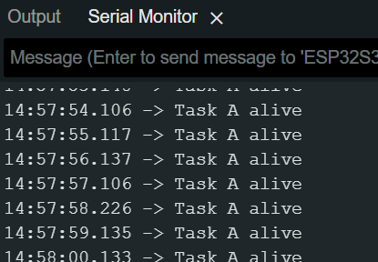

# FreeRTOS Task Management and Scheduling

## 1. Hardware and software
* **Board:** ESP32-S3-DevKitC-1 v1.1
* **RGB LED Pin:** GPIO 38
* **Software:** Arduino IDE 2.x (esp32 by Espressif Systems)
* **Serial Monitor Baud Rate:** 115200

## 2. Baseline implementation
Below is the baseline Serial Monitor output showing both tasks executing periodically.

## 3. Prediction and observation table

| Scenario | Prediction before test | Actual observation | Did it match? Why? |
| :--- | :--- | :--- | :--- |
| **A. Both tasks at priority 1** | It will operate as intended | It operates as it should
 | This is because the higher priority task sleeps and also does not require much CPU to print a line. this allows the task to be completed in a very short amount of time letting Task B execute |
| **B. Task A priority 2; Task B priority 1** | Task A will print irregularly if it is able to while task B uses the CPU more frequently | It operates as it should | It operates as it should for the same reason as the previous one, the tasks themselves do not require intense CPU usage completing very fast allowing the next task to execute |
| **C. Task A priority 1; Task B priority 2** | It will operate fine | It operates as it should | This is due to the same phenomena as the previous scenarios: the tasks do not take up much time allowing for each task to execute and then sleep not interrupting in an observable way |

## 4. Starvation experiment
* **Setup:** Task A priority 2, Task B priority 1. `vTaskDelay()` was temporarily removed from Task A.
* **Observation:** No changes could be observed
* **Explanation:** This is because the Serial.println() function has an automatic buffer that acts like a vTaskDelay() call forcing Task A into the blocked state. This allows for Task B to run.

## 5. Ready, Running and Blocked explanation
*(Write 150–250 words explaining your observations based on the RTOS task states. Ensure you address the following points:)*

* **Running state:** A task is running when it is executing/using the CPU 
* **Blocked state:** A task is blocked when it is prevented from using the CPU for a specific time
* **Ready state:** A task is ready when it is no longer in blocked and it is awaiting the scheduler to call on it 
* **Scheduler selection:** First the scheduler see's if a task is in the ready state and then it checks priority.
* **Priority impact:** Priority did not impact these tests because the tests did not use the CPU enough to cause any starvation.
* **Starvation cause:** Theoretically it should have caused task be to not be executed however becasue of the buffer in the Serial function no starvation occured
