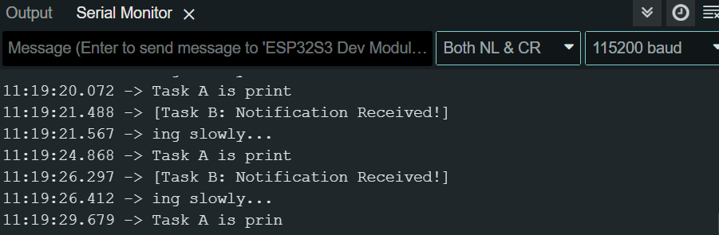

# Lecture 3 - Task Scheduling and Management

## Assignment Purpose
The purpose of this assignment is to teach about task management and how the different states can be changed within the FreeRTOS scheduler.

## Hardware and Software
* **Board:** ESP32-S3 DevKit
* **Software:** Arduino IDE
* **Serial Monitor:** 115200 baud

## Prediction and Observation Table

| Scenario | Prediction | Actual Observation | Match? Why? |
| :--- | :--- | :--- | :--- |
| **A: Task B priority = 2**  *(Task A = 1)* | Behaves normally | Behaves normally | Task B is able to preempt task A like it should when it is notified and it's condition is met |
| **B: Task B priority = 1**  *(Task A = 1)* | I think it will either allow task A to complete before finishing or time slicing will occur and the tasks will share CPU behaving like other situations | Task A completes before task B can use the CPU | Task B is unable to preempt task A because it is not high enough priority so task A finishes and then allows task B to execute |
| **C: Task B priority = 3**  *(Task A = 1)* | Behaves normally | Behaves normally | Task B is still higher priority than Task A so it will preempt when notified |

## Scheduler Behaviour Explanation

In this assignment, we can observe how the FreeRTOS scheduler manages the three primary task states: Running, Ready, and Blocked. The Running state is the state a task is in while it is actively executing on the CPU. The Ready state occurs when a task is capable of running and is waiting in line to be executed. The Blocked state is an explicitly defined state that requires some sort of event or condition to occur before the task can be unblocked and moved back to the Ready state.

Initially, Task B is in the Blocked state because it is awaiting a notification via `ulTaskNotifyTake()`; this is the way the system was designed to act so it doesn't waste CPU cycles. When Task A calls `xTaskNotifyGive()`, it sends the conditional notification that Task B needs to be unblocked. 

Because Task B is set to a higher priority in Scenarios A and C, it can immediately preempt Task A. The scheduler instantly moves Task A out of the Running state and lets Task B run. However, when Task B has the same priority as Task A (Scenario B), it will not preempt immediately. Instead, FreeRTOS places Task B into the Ready state, and it must wait until Task A finishes its time-slice or yields the CPU.

Once Task B finishes its work and blocks again, Task A can continue printing exactly from where it stopped. This happens because each task is configured with its own stack, which stores each task's own memory and exact processor state.

## Serial Monitor Observation
