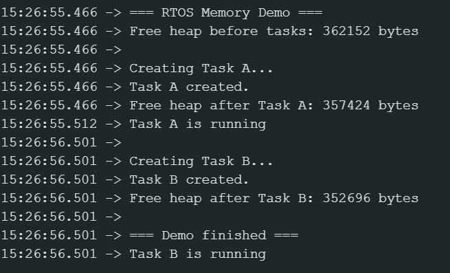
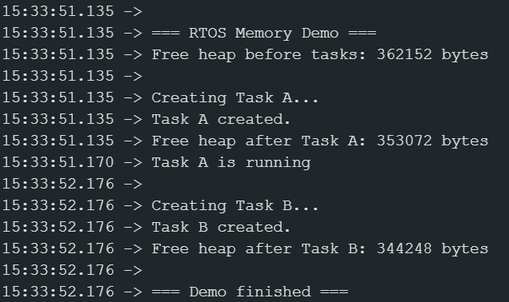

# FreeRTOS Task Memory Allocation Investigation

## 1. Memory Measurements (Stack Size = 4096)

| Measurement Point | Free Heap (bytes) |
| :--- | :--- |
| **Before Task A** | 362152 |
| **After Task A** | 357424 |
| **After Task B** | 352696 |

## 2. Memory Measurements (Stack Size = 8192)

| Measurement Point | Free Heap (bytes) |
| :--- | :--- |
| **Before Task A** | 362152 |
| **After Task A** | 353072 |
| **After Task B** | 344248 |

## 3. Comparison and Analysis

**a. Did the free heap change when you increased the task stack size?**
Yes the free heap size changed more memory per task was given to stack.

**b. What happened to the free heap?**
The free heap dropped significantly more after creating each task because we requested 8192 bytes (or words) per task instead of 4096, reserving more of the global heap for the tasks.

**c. Why does a task need stack memory?**
A task needs its own stack to store local variables, function parameters, return addresses during function calls, and its exact processor state/registers during a context switch when the scheduler pauses it.

**d. In your own words, explain: Why does creating a FreeRTOS task use RAM?**
Creating a task consumes RAM because FreeRTOS must dynamically allocate memory from the heap for two main things: the Task Control Block (TCB), which tracks the task's state and priority, and the task's dedicated stack memory. I observed something odd however: the heap appeared to decrease more than the configured stack size, extra bytes:  632 bytes for task A and 702 bytes for Task B when stack was 4096, 888 for task A and 632 for task B when stack was 8192 bytes. Initially I thought the TCB was changing sizes, however after further research it appears this overhead is caused by the ESP32 automatically allocating standard library buffers, padding, and background system tasks while the delay() functions are running.

## 4. Serial Monitor Output

