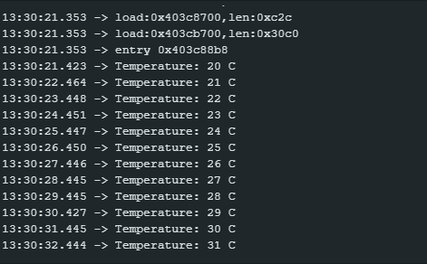

# RTOS Queue Assignment

## 1. Purpose
This program demonstrates how a FreeRTOS queue can be used to pass data between tasks. It serves as a basic example of the Producer–Queue–Consumer architecture.

## 2. How It Works
* **Sensor Task (Producer):** This task simulates reading a temperature, starting at 20 °C and incrementing by 1 every second. It sends this integer to the queue using `xQueueSend()`.
* **Queue:** Created using `xQueueCreate()`, this data structure sits between the tasks and has a limited capacity of 5 item slots. It operates on a First In, First Out (FIFO) basis, copying the data and temporarily storing it until it is read.
* **Display Task (Consumer):** This task monitors the queue using `xQueueReceive()`. When it retrieves a temperature value from the queue, it prints the formatted string to the Serial Monitor.

## 3. Serial Monitor
*(Note: Add your actual screenshot image file to the repository and update this link)*

## 4. Reflection
The queue is useful because it lets the tasks share data in an organized way. A queue sits between the tasks, meaning the producer can create data, the queue can temporarily store it, and the consumer can process it later. As a result, the two tasks do not need to run at exactly the same time to communicate effectively.